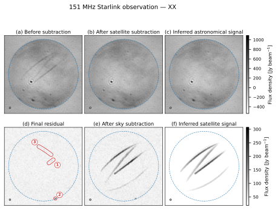

# tabascal

[](https://github.com/epfl-radio-astro/tabascal/actions/workflows/test.yaml)
[](https://tabascal.readthedocs.io/en/latest/)
[](https://github.com/epfl-radio-astro/tabascal/actions/workflows/test.yaml)
[](https://www.gnu.org/licenses/gpl-3.0)
[](https://github.com/epfl-radio-astro/tabascal/blob/main/pyproject.toml)
[](https://doi.org/10.1093/mnras/stad1979)
[](https://doi.org/10.1051/0004-6361/202554596)

Trajectory-based RFI subtraction for radio interferometric data.

**This is the official TABASCAL repository and the only maintained home of the
project.** It supersedes the earlier repository at
[`chrisfinlay/tabascal`](https://github.com/chrisfinlay/tabascal), which is
archived and no longer maintained. Documentation is published at
[tabascal.readthedocs.io](https://tabascal.readthedocs.io/).



A result on real data from a low-frequency aperture array (EDA2): a 151 MHz observation (XX) crossed by several Starlink satellites. The satellite trails dominating the field (a) are gone after subtraction (b), leaving the inferred sky (c). Reversing the split shows what was removed — subtracting the sky instead (e) isolates the trails, which the model reconstructs as the satellite signal (f). The final residual (d) is noise-like apart from the marked features. Note the two rows use different flux scales: the satellite signal is a few hundred Jy/beam against a sky spanning roughly -400 to 1000 Jy/beam.

## Installation

TABASCAL is pure Python — no compiler or CUDA toolkit is needed to install it.
It requires **Python 3.10–3.13**.

TABASCAL reads and writes Measurement Sets and therefore needs
**`python-casacore`**, which is *not* a pip dependency. Install it with conda
first, then pip-install TABASCAL into the same environment:

```bash
conda create -n tab-env -c conda-forge "python>=3.10,<3.14" python-casacore
conda activate tab-env
```

TABASCAL is not on PyPI yet, so install it from the repository:

```bash
pip install git+https://github.com/epfl-radio-astro/tabascal.git
```

For NVIDIA GPU support (Linux only), use the `cuda12` extra (or `cuda13`):

```bash
pip install "tabascal[cuda12] @ git+https://github.com/epfl-radio-astro/tabascal.git"
```

`python-casacore` is pip-installable on **linux-x86_64**, so the conda step can
be skipped there. On **macOS and linux-aarch64** the conda route is strongly
recommended, as `python-casacore` is difficult to build from source on those
platforms.

See the [installation guide](https://tabascal.readthedocs.io/en/latest/usage.html#installation)
for the full details.

## Basic usage

TABASCAL runs are defined by a YAML configuration file. To run it on a
Measurement Set:

```bash
tabascal run -c path/to/config.yaml -ms path/to/file.ms
```

Products go to `plots/` and `results/` beside the Measurement Set. Pass
`-od path/to/output_dir`, or set `data.out_dir`, to write them elsewhere.

The results are written to a `.zarr` file and then transferred into the
Measurement Set as the `TAB_AST_DATA`, `TAB_RFI_DATA`, `TAB_AST_RES`,
`TAB_RFI_RES` and `TAB_RES_DATA` columns.

Every option is listed by the help context:

```bash
tabascal -h                # top-level: lists the subcommands
tabascal run -h            # every option of the run subcommand
tabascal light-curve -h    # every option of the light-curve subcommand
tabascal search -h         # every option of the search subcommand
```

The satellite orbital elements TABASCAL needs are fetched automatically from the
[IAU CPS SatChecker](https://satchecker.cps.iau.org/) service, via the
[satchecker-client](https://github.com/epfl-radio-astro/satchecker-client)
package — no account or credentials are required.

For a complete worked example, from simulating a dataset with `sim-vis` through
to subtracting the satellite RFI, see the
[usage guide](https://tabascal.readthedocs.io/en/latest/usage.html).

## Documentation

Full documentation is at
[tabascal.readthedocs.io](https://tabascal.readthedocs.io/), including:

- [Usage guide](https://tabascal.readthedocs.io/en/latest/usage.html) — installation and a worked example
- [Configuration file](https://tabascal.readthedocs.io/en/latest/config.html) — every config option, including model precision
- [RFI-visibility kernels](https://tabascal.readthedocs.io/en/latest/kernels.html) — the optional compiled CPU/GPU kernels
- [Components](https://tabascal.readthedocs.io/en/latest/components.html) — the modular forward model
- [Satellite orbit records](https://tabascal.readthedocs.io/en/latest/orbits.html) — where orbital elements come from
- [Developer install](https://tabascal.readthedocs.io/en/latest/installation.html) — pixi environments, tests and docs builds

## Citing tabascal

- Finlay, Bassett & Kunz (2023), *Trajectory-based RFI subtraction and calibration for radio interferometry*, MNRAS — [10.1093/mnras/stad1979](https://doi.org/10.1093/mnras/stad1979)
- Finlay, Bassett & Kunz (2025), *TABASCAL: Removing multi-satellite interference from radio interferometry observations*, A&A — [10.1051/0004-6361/202554596](https://doi.org/10.1051/0004-6361/202554596)
